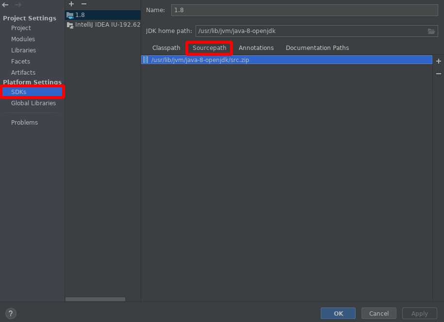

# 开始

## 准备工作

使用 Intellij 查看 JDK 源码。

首先，如果被配置 JDK 源码目录的话，Intellij 会使用 decompiler 反编译字节码。这样的源码学习效果并不好。所以我们需要手动下载/找到 JDK 源码，然后配置 Intellij，使其能够找到对应的 JDK 源码。

### 下载 src.zip

- Arch Linux 下

使用 pacman 即可安装 JDK 源码。

如 JDK 8

```bash
sudo pacman -S openjdk8-src
```

下载好的 JDK 源码以压缩包的形式位于 `/usr/lib/jvm/java-8-openjdk` 目录下，名为 `src.zip` 的文件。

- 其他平台

由于我使用的是基于 Arch 的 Manjaro，所以使用的是 pacman 的方式下载的源码，其他平台开以下载 JDK，安装目录下应该会有 src.zip 文件，或者可以去[这儿](https://jdk.java.net/java-se-ri/8)下载 JDK 解压，解压后的目录下即有需要的 src.zip。

### 配置 Intellij

打开 `File > Project Structre > Plateform Settings > SDKS`，选择 `Sourcepath`，将 src.zip 添加进去即可。

